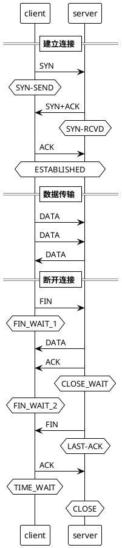

## TCP 三次握手, tcp three way handshake,   四次挥手, TCP 状态  (SYN, FIN, ACK, PSH, RST, URG)
### TCP (Transmission Control Protocol)
TCP 工作在网络OSI的七层模型中的第四层 - Transport层  
TCP标志位  
在TCP层,有个FLAGS字段,这个字段有以下几个标识: SYN, FIN, ACK, PSH, RST, URG.  

其中,对于我们日常的分析有用的就是前面的五个字段。它们的含义是: 

SYN表示建立连接,SYN (synchronous) 是TCP/IP建立连接时使用的握手信号。

FIN表示关闭连接,FIN(Finish)—为1表示发送方没有数据要传输了,要求释放连接。

ACK表示响应,ACK (ACKnowledge Character) 

PSH表示有 DATA数据传输,(Push)

RST表示连接重置。Reset重连位~ 当RST=1的时候通知重新建立TCP连接

URG: urgent

其中,ACK是可能与SYN,FIN等同时使用的,比如SYN和ACK可能同时为1,它表示的就是建立连接之后的响应,

如果只是单个的一个SYN,它表示的只是建立连接。

TCP的几次握手就是通过这样的ACK表现出来的。

但SYN与FIN是不会同时为1的,因为前者表示的是建立连接,而后者表示的是断开连接。

RST一般是在FIN之后才会出现为1的情况,表示的是连接重置。

一般地,当出现FIN包或RST包时,我们便认为客户端与服务器端断开了连接；而当出现SYN和SYN+ACK包时,我们认为客户端与服务器建立了一个连接。

PSH为1的情况,一般只出现在 DATA内容不为0的包中,也就是说PSH为1表示的是有真正的TCP数据包内容被传递。

TCP的连接建立和连接关闭,都是通过请求－响应的模式完成的。

### TCP三次握手
TCP是主机对主机层的传输控制协议,提供可靠的连接服务,采用三次握手确认建立一个连接: 

第一次握手:  (A -> [SYN] -> B) 主机A发送位码为syn＝1, seq=1234567(seq随机产生)的数据包到服务器,主机B由SYN=1知道,A要求建立联机；(seq:Sequence number),并进入SYN_SEND状态,等待服务器确认；

第二次握手:  (B -> [SYN/ACK] -> A) 主机B收到请求后要确认联机信息,向A发送syn=1,ack=1234568(主机A的seq+1),seq=7654321(随机产生)的包；此时服务器进入SYN_RECV状态；

第三次握手:  (A -> [ACK] -> B) 主机A收到后检查ack number是否正确,即第一次发送的seq number+1,以及位码syn是否为1,若正确,主机A会再发送ack number=(主机B的seq+1),主机B收到后确认seq值与ack=1则连接建立成功。客户端和服务器进入ESTABLISHED状态

完成三次握手,主机A与主机B开始传送数据。

TCP四次握手关闭连接 (Four-way Handshake) 
  
A -> [ACK/FIN] -> B
  
B -> [ACK] -> A
  
B -> [ACK/FIN] -> A
  
A -> [ACK] -> B
  
ACK/FIN包即终结包,由于连接还没有关闭, FIN包总是打上ACK标记。没有ACK标记而仅有FIN标记的包不是合法的包,并且通常被认为是恶意的。

有时,如果主机需要尽快关闭连接(或连接超时,端口或主机不可达),RST (Reset)包将被发送。注意在,由于RST包不是TCP连接中的必须部分, 可以只发送RST包(即不带ACK标记)。但在正常的TCP连接中RST包可以带ACK确认标记。

注意: 由于SYN包是用来初始化连接的, 它不可能和FIN或RST标记一起出现,这也是一个恶意攻击。当网络中出现一下包组合时,表明网络已经遭受到攻击了,如: SYN/FIN,SYN/FIN/PSH, SYN/FIN/RST, SYN/FIN/RST/PSH。

http://blog.csdn.net/crystal0011/article/details/8954674

http://www.voidcn.com/blog/chenyujin1314520/article/p-5999167.html

https://github.com/chemdemo/chemdemo.github.io/blob/master/issues/tcp_notes.md
  
>https://xie.infoq.cn/article/84998c291eb69b50fad90a132?utm_source=rss&utm_medium=article

## 四次挥手

断开连接的挥手动作是4次，其实就是两个来回，每一个来回关闭一个方向的数据传输。

### tcp 三次握手, 四次挥手, plantuml

连接在FINWAIT-2超时后并不会进入TIMEWAIT状态，也不会发送reset，而是直接消失。
TIMEWAIT 持续 时间 60s

>https://blog.csdn.net/dog250/article/details/81256550
>https://datatracker.ietf.org/doc/html/rfc793
