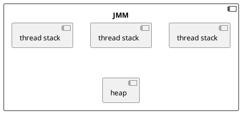
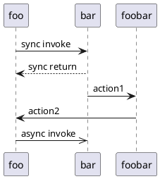

## UML basic
### 部署图
部署图描述的是系统运行时的结构，展示了硬件的配置及其软件如何部署到网络结构中。一个系统模型只有一个部署图，部署图通常用来帮助理解分布式系统。
### 组件图
>https://zhuanlan.zhihu.com/p/78244670
Component diagram shows components, provided and required interfaces, ports, and relationships between them. This type of diagrams is used in Component-Based Development (CBD) to describe systems with Service-Oriented Architecture (SOA).
Component-based development is based on assumptions that previously constructed components could be reused and that components could be replaced by some other "equivalent" or "conformant" components, if needed.
The artifacts that implement component are intended to be capable of being deployed and re-deployed independently, for instance to update an existing system.

组件图适用于基于组件的开发模式 (Component-Based Development, CBD），它通过组件，及组件的接口、端口来表达组件的构成及其关系。当我们使用 CBD 进行开发时，其实是对行为进行了抽象，一个组件提供了若干的行为，组件图通过接口、端口的方式来表达组件间的连接，很形象的表达出组件是可被替换的概念，一个组件可以被另一个提供了相同接口的组件替换。因此，当我们通过组件进行建模时，能够设计出一个扩展性良好的系统。

使用场景
组件图是用于描述系统的物理、逻辑结构的，他关注组件间的关联 (使用什么接口，通过什么端口通讯），强调通过接口来描述组件行为，因此， 对于后端来说，组件图比较适用于 SOA 架构、**微服务**架构的表达，描述整个系统的结构以及子系统间的通讯方式，或者表达一些基础设施，比如脚手架，消息中间件等等。 对于前端来说，组件图适合在使用类似 react、vue 这样组件化的前端技术框架时，表达对组件的设计，比如一个页面会有个骨架组件，骨架组件包含了导航组件，列表组件等等。

### 时序图, Sequence Diagram

### 同步
一条线，带有指向接收生命线的实心箭头    此图形表示同步调用操作，在此操作中，源发送一条等待来自目标的返回消息的消息，然后源才能继续执行其他操作。
### 同步返回
一条虚线，带有指向发送生命线的实心箭头    此图形表示来自过程调用的返回消息。当创建同步消息时，缺省情况下会创建返回消息。可在首选项窗口中更改此缺省设置。

### 异步
一条线，带有开口箭头    此图形表示异步信号或异步调用，在此过程中，源对象发送消息后立即继续下一步骤。

>https://www.ibm.com/docs/zh/rsas/7.5.0?topic=diagrams-messages-in-uml
>http://note.sdo.com/u/1187426958/n/6NHae~jmchewLX00k002BF

标准建模语言UML的重要内容可以由哪五类图 (共9种图形) 来定义，并简要说明这些图所描述的对象。
    标准建模语言UML的重要内容可以由下列五类图(共9种图形)来定义:
### 用例图
从用户角度描述系统功能,并指出各功能的操作者。
### 静态图(Static diagram)
包括类图、对象图和包图。其中类图描述系统中类的静态结构。不仅定义系统中的类,表示类之间的联系如关联、依赖、聚合等,也包括类的内部结构(类的属性和操作)。类图描述的是一种静态关系,在系统的整个生命周期都是有效的。对象图是类图的实例,几乎使用与类图完全相同的标识。他们的不同点在于对象图显示类的多个对象实例,而不是实际的类。一个对象图是类图的一个实例。由于对象存在生命周期,因此对象图只能在系统某一时间段存在。包由包或类组成,表示包与包之间的关系。包图用于描述系统的分层结构。
### 行为图(Behavior diagram)
描述系统的动态模型和组成对象间的交互关系。其中状态图描述类的对象所有可能的状态以及事件发生时状态的转移条件。通常,状态图是对类图的补充。在实用上并不需要为所有的类画状态图,仅为那些有多个状态其行为受外界环境的影响并且发生改变的类画状态图。而活动图描述满足用例要求所要进行的活动以及活动间的约束关系,有利于识别并行活动。
### 交互图(Interactive diagram)
描述对象间的交互关系。其中顺序图显示对象之间的动态合作关系,它强调对象之间消息发送的顺序,同时显示对象之间的交互;合作图描述对象间的协作关系,合作图跟顺序图相似,显示对象间的动态合作关系。除显示信息交换外,合作图还显示对象以及它们之间的关系。如果强调时间和顺序,则使用顺序图;如果强调上下级关系,则选择合作图。这两种图合称为交互图。
### 实现图( Implementation diagram )
其中构件图描述代码部件的物理结构及各部件之间的依赖关系。一个部件可能是一个资源代码部件、一个二进制部件或一个可执行部件。它包含逻辑类或实现类的有关信息。部件图有助于分析和理解部件之间的相互影响程度。
    
  
  
  
  
    2、 简要说明如何绘制UML活动图。
  
  
    UML 活动图记录了单个操作或方法的逻辑，单个用户案例，或者单个业务流程的逻辑。要创建一个 UML 活动图，您需要反复执行下列步骤。
  
  
    第一步，定义活动图的范围首先应该定义您要对什么建模。单个用户案例力？一个用户案例的一部分？一个包含多个用户案例的商务流程？一个类的单个方法？一旦您定义了您所作图的范围，您应该在其顶部，用一个标注添加标签，指明该图的标题和唯一的标示符。您有可能也想要包括该图的时间甚至作者名。
  
  
    第二步，添加起始和结束点每个活动图有一个起始点和结束点，因此您也要马上添加它们。在《UML 精粹》(UML Distilled) (参见参考资料)，Fowler 和 Scott 认为结束点是可选的。有时候一个活动只是一个简单的结束，如果是这种情况，指明其唯一的转变是到一个结束点也是无害的。这样，当其他人阅读您的图时，他或她知道您已经考虑了如何退出这些活动。
  
  
    第三步，添加活动如果您正对一个用户案例建模，对每个角色(actor)所发出的主要步骤引入一个活动(该活动可能包括起始步骤，加上对起始步骤系统响应的任何步骤)。如果您正对一个高层的商务流程建模，对每个主要流程引入一个活动，通常为一个用户案例或用户案例包。最后，如果您正对一个方法建模，那么对此引入一个活动是很常见的。
  
  
    第四步，添加活动间的转变我的风格总是应该退出一个活动，即使它是转变到一个结束点。一旦一个活动有多个转变时，您必需对每个转变加以相应标示。
  
  
第五步，添加决策点有时候，您所建模的逻辑需要做出一个决策。有可能是需要检查某些事务或比较某些事务。要注意的是，使用决策点是可选的。例如，在图 1 中，我可以只是简单地将"接受"和"拒绝"两个转变直接接到"在大学报名(Enroll in University)"活动。
  
第六步，找出可并行活动之处当两个活动间没有直接的联系，而且它们都必需在第三个活动开始前结束，那它们是可以并行运行的。在图 1 中，您看到是有可能"参加简要介绍(attend overview)"和"报名研讨班(enroll in seminars)"可以按任意次序进行，但是它们都得在您结束整个流程前完成。

### uml spec
>https://www.omg.org/spec/UML/2.5.1/PDF