这个模块的重写发生在 2024 年，历时约 3 个月，当时我还没有开始大量使用 AI 辅助编程。业务代码约 5000 行，单元测试约 3.6 万行（其中有大量重复代码——当时急于覆盖各种边界情况，靠堆 case 保证覆盖率）。重写的时候注意力都在把功能做对上，并没有想过「我要用哪种设计模式」，只是在纠结怎么把问题拆清楚、用面向对象的方式把责任分开、把可能变化的部分封装起来。Redis 里的缓存数据是嵌套的树形结构，解析时写了几个递归调用——那几段递归是当时感觉最复杂的地方。

这篇文档写于此后。某次和一个朋友聊天，对方问起对设计模式有没有了解，当时长期没有专门研究过，没说出个所以然。后来那个问题偶尔还会浮上来，然后有一天和 conflict check 关联到了一起——这是我开发过的比较复杂的模块，不如让 AI 帮我看看，里面有没有哪段代码接近某种设计模式，或者有哪些场景适合用设计模式来解决。就让 Copilot + Claude Sonnet 4.6 分析了一下——结果发现竟然有 9 种。当然，有些模式用得并不标准，还有些是因为 Python 的语言特性而采用了变通的实现方式。整理的过程中还发现了几处有性能优化空间的地方。

## 背景

防火墙策略在应用到设备之前，需要先在缓存中进行冲突检测。防火墙策略由 “网络编排器” 缓存在 Redis 中，`address_object` 和 `service_object` 两类对象共用同一种数据结构，各自包含两种角色：

- **object**：基础对象，`key` 是名称，`value` 是一个数组，元素是实际的 IP 地址/CIDR 网段（address_object）或协议/端口（service_object）
- **group_object**：分组对象，有自己的 `name` 和 `value`，`value` 是一个数组，数组元素是 `object` 的 name 或另一个 `group_object` 的 name

group 和 object 形成嵌套结构：一个 group 的 value 列表里，既可以直接引用 object，也可以引用其他 group，形成递归树。

## 问题

冲突检测模块的目标是比对用户提交的网络策略与 Redis 中的已有策略，决定后续应当新建、更新，还是无需操作。

每条策略（用户输入或设备缓存）有以下几个关键属性：

- **src**：源地址数组，每个元素是 `object_name` 或 `group_name`（address_object）
- **dst**：目标地址数组，结构与 src 相同
- **service**：协议和端口数组，每个元素是 `service_object_name` 或 `service_group_name`

src 和 dst 属于 address_object，service 属于 service_object。两种类型都具备 group/object 嵌套结构，因此 `PolicyObject` 类可以同时表达这两种类型的对象。

## 设计模式

冲突检测模块共使用了 9 种设计模式，分布在数据表示与加载、对象构建和算法执行三个层次。

### 数据表示与加载

#### Composite — 统一树形结构

将 Redis 中的 object 和 group_object 统一抽象为 `PolicyObject`，形成树形结构：

| 角色      | 映射                             |
| --------- | -------------------------------- |
| Component | `PolicyObject`（统一接口）       |
| Leaf      | `object`（IP/网段，没有子节点）  |
| Composite | `group_object`（包含子节点的组） |

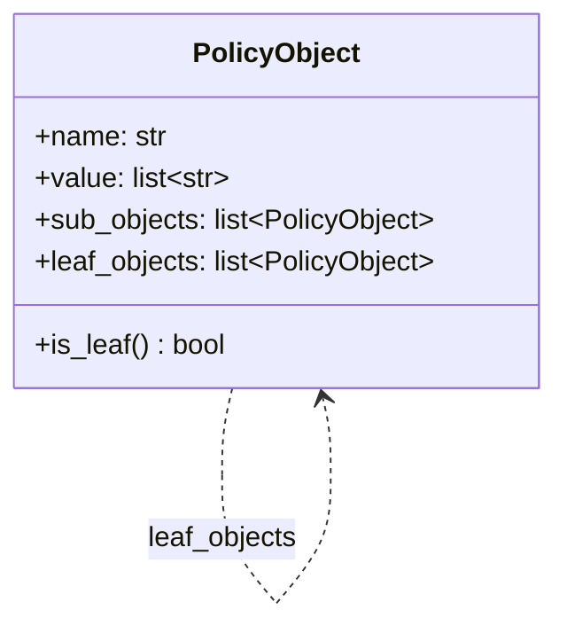

- **Leaf**：`sub_objects` 为空，`value` 存放实际的 IP 地址/CIDR 或协议/端口
- **Composite**：`sub_objects` 包含直接子节点，`value` 为空
- `leaf_objects`：递归展开后所有叶子节点的缓存，冲突检测时直接遍历，无需重复递归

每条策略用 `Policy` 对象表达，其中 src、dst、service 均为 `PolicyObject` 列表：

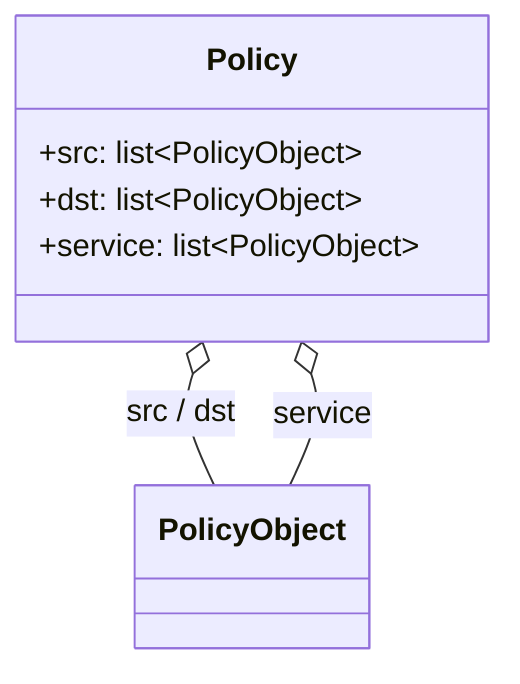

#### Adapter — 原始数据适配

Redis 中存储的是 dict 格式的原始数据（对象名称到值数组的映射）。Adapter 将其转换成 `PolicyObject` 树，隔离了业务逻辑对缓存数据格式的直接依赖。地址对象和服务对象各有对应的 Adapter，另有一个 Adapter 将外部 API 返回的 dict 转换为内部策略领域对象。

Adapter 与 Composite 的分工：**Adapter 是转换动作**，解决接口不兼容（dict → 对象）；**Composite 是转换结果的数据结构**，解决 group 嵌套引用 group 的树形数据表达问题。Adapter 内部用 Composite 来组织输出，两个模式嵌套配合。

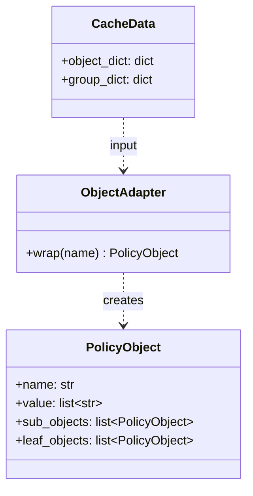

#### Facade — 统一数据访问入口

Facade = **Redis 读取 + Adapter 转换 + Composite 组织**，三件事全部封装在内部，外部只看到干净的对象接口。

内部数据流：

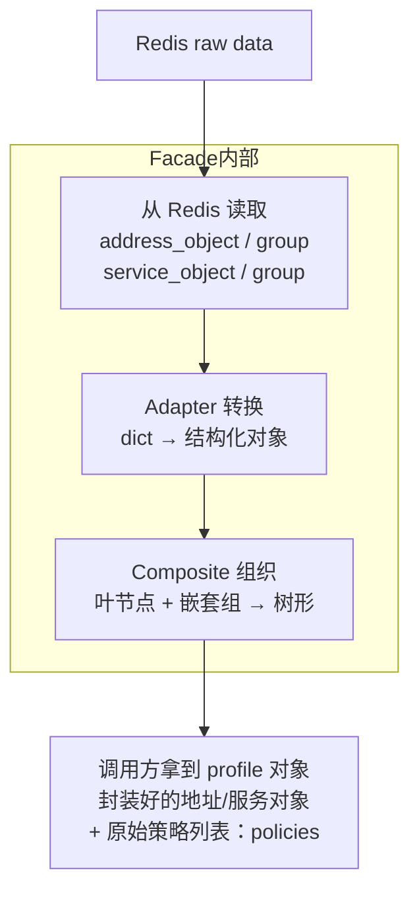

调用方只需面对 profile 对象和封装好的 PolicyObject，无需关注 Redis 数据格式、Adapter 实现或 group 的嵌套层级。

**策略列表的后续处理**：Facade 的 `policies()` 返回的是 Redis 里的原始策略列表，不是封装好的领域对象。Checker 在比较循环里逐条取出原始策略，调用 `wrap_policy(raw, profile)` 逐一封装。`profile` 也作为参数传入，因为封装时需要通过 Facade 的 Adapter 方法查询地址/服务对象。

Facade 并不在初始化时把所有 address object 批量转换成 PolicyObject 树——它只是把 Redis 的原始 dict（address_object、address_group 等）一次性 load 进内存字段。每封装一条策略时，才调用 Facade 的 Adapter 方法，用该策略的 src/dst name list 从内存 dict 里查出对应条目，实时组装 Composite 树。**dict 是预加载的，对象树是按需构建的。**

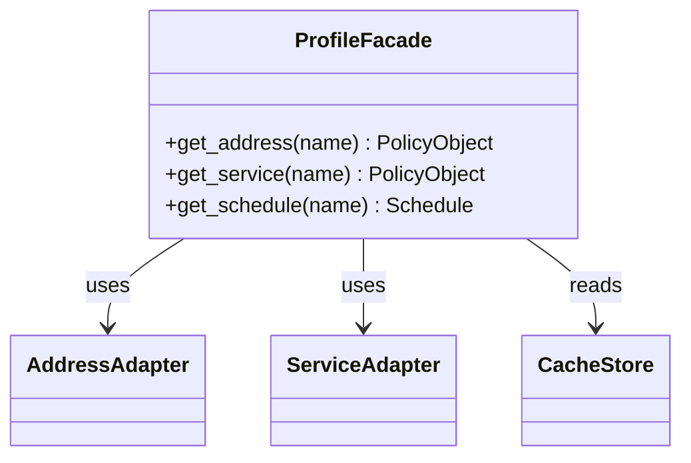

#### Proxy（缓存代理）— 减少重复访问

冲突检测时，同一设备的 profile 会被多条策略反复查询。Proxy 在调用方与底层 Redis 缓存之间增加一层本地字典，命中时直接返回，未命中时才访问底层存储并将结果存入本地字典。

Proxy 缓存的是从 Redis 反序列化出来的**原始 profile 对象**，以设备 cache key 为键。该对象包含 address/service 的原始 dict（各地址和服务相关的字典字段）以及原始策略列表等全部字段。Facade 每次都从这个已缓存的原始对象中读取数据，不再重新访问 Redis。

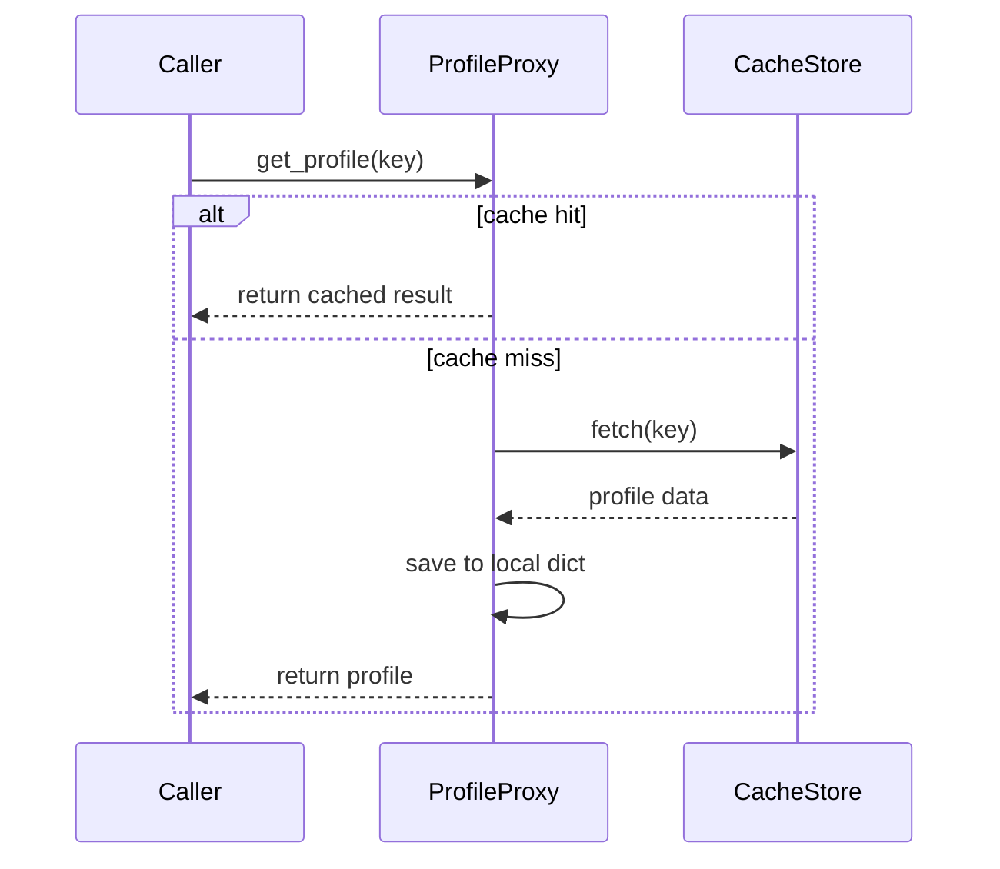

### 对象构建

#### 静态工厂方法 — 按变体创建策略对象

`DevicePolicy` 类上有四个 `@staticmethod` 工厂方法，对应 Redis 缓存的防火墙策略的四种变体。每个方法以名称区分变体，隐藏内部构建差异。这与 GoF 工厂方法（依赖子类多态）有所不同，更接近 *Effective Java* 中描述的静态工厂方法：方法名比构造函数更有表达力，内部实现可以随版本变化而不影响调用方。

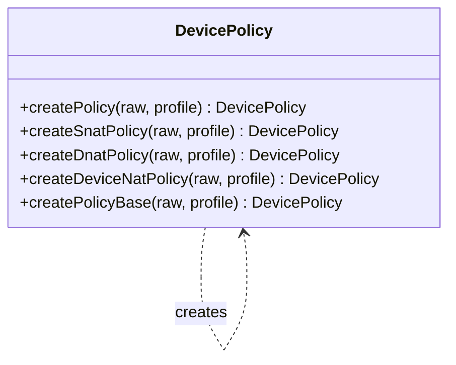

#### Builder — 分步组装复杂对象

`DevicePolicy` 对象的各字段来自不同数据源（zone、service、schedule、address）。每个静态工厂方法充当 Builder 的 Director，编排构建步骤：`createPolicyBase()` 承担公共基础步骤（创建对象、填充 zone / service / schedule），各变体方法在此基础上分别组装不同的 src/dst 地址字段，最终返回完整对象。

- **普通策略** `createPolicy()`：src 和 dst 均为普通地址
- **源 NAT** `createSnatPolicy()`：src 携带 NAT 映射（IP pool → 转换后地址），dst 为普通地址
- **目的 NAT** `createDnatPolicy()`：src 为普通地址，dst 携带 NAT 映射（VIP → 实际地址）

P* 设备 NAT 变体的策略结构差异较大，不使用共享基础步骤，从头独立组装所有字段。

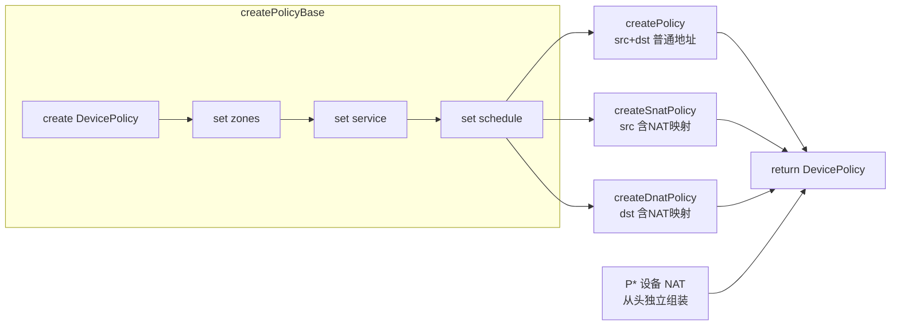

### 算法执行层

#### Template Method — 定义检测骨架

父类定义检测流程的固定步骤，子类只覆盖其中差异化的钩子方法。`check_conflict()` 定义骨架：加载策略列表 → 逐条 zone 检查 → 包装策略 → 与用户策略比较 → 错误处理。新增设备类型只需继承并覆盖钩子，无需修改骨架。

具体子类共 5 个，通过两层继承隔离不同设备类型的 NAT 差异：`NatChecker` 集中 NAT 策略的公共逻辑（加载 NAT 策略列表、发送条件、错误处理）；F* 设备的源 NAT 和目的 NAT 各自直接继承 `NatChecker`，前者只覆盖比较规则（放宽为 MATCH/SUBSET 均接受），后者在骨架末尾追加 VIP 二次检测；P* 设备有独立的 `DeviceNatChecker` 基类，它覆盖了 `check_conflict()` 实现双阶段检测（先比对 NAT 策略，匹配后再与普通策略二次比对），其下的两个叶子类只覆盖地址准备钩子。

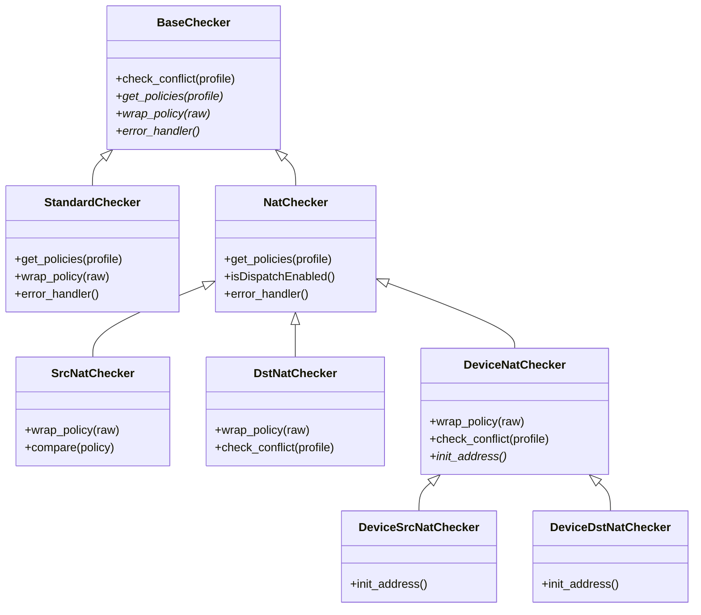

#### Strategy — 运行时切换行为

冲突检测对不同类型的策略（普通、源 NAT、目的 NAT）使用不同的检测逻辑，每种逻辑对应一个检测策略。策略对象初始均以基类创建，封装阶段根据节点属性通过 `__class__` 赋值直接替换运行时子类，无需重建对象。切换完成后进入冲突检测主逻辑，调用方只调用统一接口，各对象按自身运行时类型执行对应检测行为——策略切换对外层代码完全透明。

经典 GoF Strategy 通常将策略对象单独注入（组合），这里的做法是策略对象本身即是策略的载体：通过 `__class__` 赋值，在不重建对象的情况下完成子类替换，是 Python 动态类型的一种实用变体。

源 NAT 和目的 NAT 的切换时机不同：源 NAT 节点在加入路径时即可确定，切换立即完成；目的 NAT 则只有路径末尾的最后一个节点才需要以 DNAT 方式做冲突检测，因此必须等路径上所有节点按序收集完毕后，再通过第二轮遍历定位并切换该节点的类型。

Strategy 与 Template Method 协同：Template Method 固定骨架顺序，Strategy 决定骨架中钩子的具体实现。

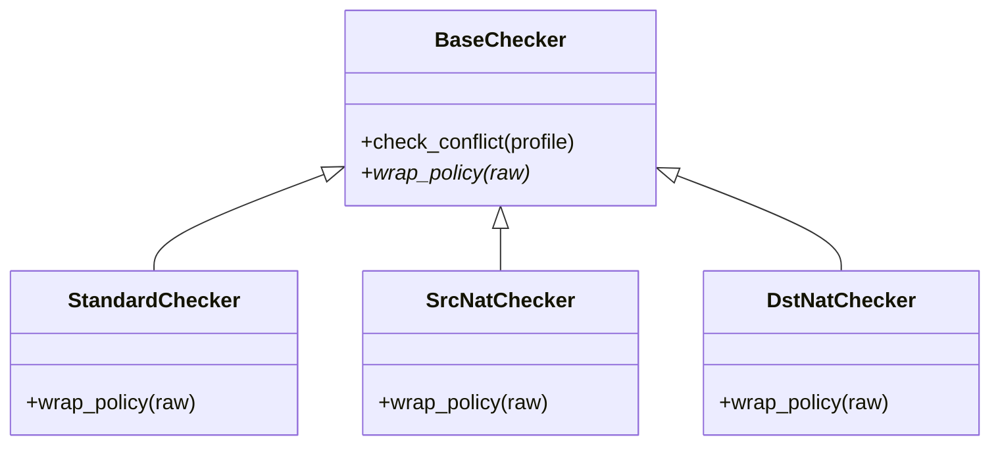

#### Special Case — 以异常代替空返回

当策略对象包含宽泛私网地址范围（如 `10.0.0.0/8`）时，该策略不具备比较意义。包装阶段直接抛出专用异常，由比较循环的第一个 `except` 子句静默消费，循环继续。这避免了返回 `None` 后在每个调用点进行 `None` 判断的扩散。严格来说这是 Martin Fowler 的 Special Case 模式：目标与 Null Object 相同（避免 null 判断扩散），但用异常代替无操作对象，语义更清晰。

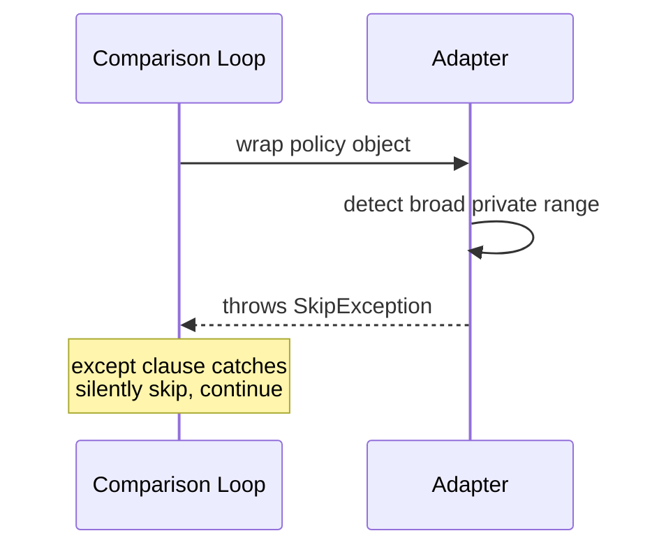

## 模式组合

这 9 种模式分层协作：

**数据加载层**：缓存原始 dict → Adapter 转换成 PolicyObject → Composite 统一树形表达 → Facade 对外暴露简洁接口 → Proxy 控制缓存访问避免重复查询。

**算法执行层**：Template Method 固定检测骨架 → Strategy 在运行时切换不同变体行为。

**跨层**：静态工厂方法 + Builder 负责各类策略对象的分步组装，Special Case 在源头过滤无意义输入。

## 小结

`sub_objects` 保留了原始的直接子节点关系，便于调试和展示树结构；`leaf_objects` 是为冲突检测专门缓存的展开结果，是对标准 Composite 的实用扩展——牺牲少量内存，换取检测时无需重复递归遍历。

设计模式在实际项目中很少单独出现。理解它们的关键不是记住定义，而是能识别每个模式在系统里负责解决哪个维度的问题，以及它们如何分工协作。

## 异常处理流程

比较循环内包裹了一个 `try/except` 块，按顺序声明 7 个 `except` 子句。Python 运行时按声明顺序匹配异常类型，第一个命中的子句处理，之后的子句不再执行。各子句可以静默消费、记录结果后继续循环，或向上抛出终止整条流程。

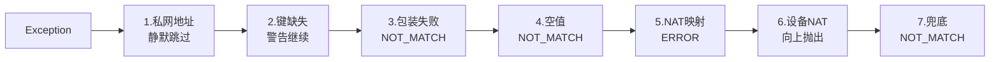

这与 GoF 责任链模式在语义上一致（有序、首匹配），但实现上是 Python 语言内置的异常分发机制，而非显式构建的 Handler 对象链。

---

## 已知优化点

### 比较结果状态机改用 GoF State 模式

当前的比较结果跟踪用枚举字段 + `update_compare_result()` 实现，本质是优先级累积。从行为上看，四种结果之间存在明确的单向迁移规则，完全可以改用标准 GoF State 模式实现：每种结果对应一个 State 类，封装该状态下的 `update()`、`on_enter()`、`error_handler()` 行为，通过替换 Context 持有的 State 对象完成迁移，而非外部 if/elif 分支。

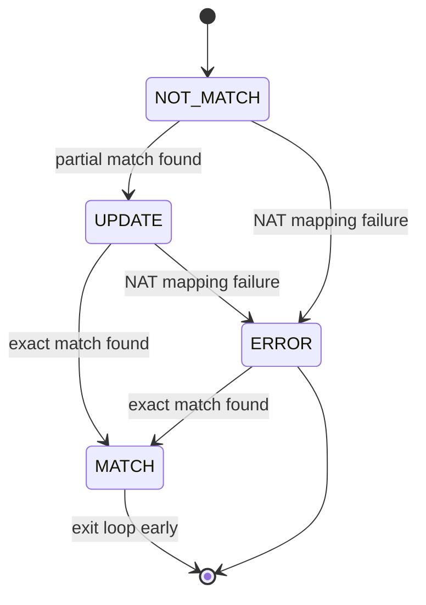

收益：各状态的进入行为（如 MATCH 时绑定现有的 policy id、ERROR 时记录 error_type）内聚到 State 类内部，消除散落在比较循环中的多处 if/elif 判断，新增状态只需新增一个类。

### PolicyObject 树的重复构建

当前实现中，每封装一条设备缓存策略时，都会调用 Facade 的 Adapter 方法，从内存 dict 里实时递归组装 Composite 树。如果 100 条策略都引用了同一个 `server-group-A`，这棵树会被 rebuild 100 次。

这个重复是可以消除的。Redis 的 address/service object dict 更新频率是天级的，对于同一个请求下的一组规则对应的冲突检测来说，dict 是完全稳定的；应用层也没有对 dict 的写操作。因此，同名 object 构建出的 PolicyObject 树是幂等且安全可复用的。

优化方式是在 Facade 内部增加一层以 object name 为 key 的 dict 缓存，首次构建后存入，后续同名请求直接返回缓存结果，不再递归。这是对 Adapter 方法的 memoization，本质上也是 Flyweight 模式的变体——在同一 profile 作用域内共享不可变的 PolicyObject 实例。

> 相关：[Composite Pattern](/composite-pattern)
