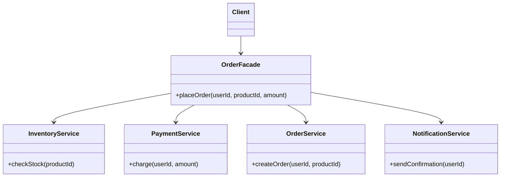

## 外观模式, Facade Pattern

看到"门面"这个词，大家一定都觉得很熟悉。日常生活中的"门面"就是我们买东西的地方，它跟各种商品的生产商打交道，收集商品后再卖给我们。如果没有"门面"，我们将不得不直接跟各种各样的生产商买商品。

Facade 模式正是这样一个"门面"：我们本来需要与后台的多个类或接口打交道，而 Facade 模式在客户端和后台之间插入一个中间层——门面，这个门面跟后台的多个类或接口打交道，客户端只需要跟门面打交道即可。

Facade 类是一个简化的用户接口，它和后台中的多个类产生依赖关系，而客户类则只跟 Facade 类产生依赖关系。后台的开发者熟悉自己开发的各个类，容易解决与多个类的依赖关系；而使用者不太熟悉后台的各个类，通过 Facade 可以大大降低使用难度。

## 示例：电商下单流程



完成一次下单需要依次调用库存服务、支付服务、订单服务和通知服务。没有 Facade 时，调用方必须自己了解并编排这四个步骤：

```java
// 调用方需要知道正确的调用顺序，且任何地方下单都要重复这段逻辑
inventoryService.checkStock(productId);
paymentService.charge(userId, amount);
orderService.createOrder(userId, productId);
notificationService.sendConfirmation(userId);
```

引入 `OrderFacade`，将编排逻辑封装在内部：

```java
public class OrderFacade {
    private final InventoryService inventoryService;
    private final PaymentService paymentService;
    private final OrderService orderService;
    private final NotificationService notificationService;

    public void placeOrder(String userId, String productId, BigDecimal amount) {
        inventoryService.checkStock(productId);
        paymentService.charge(userId, amount);
        orderService.createOrder(userId, productId);
        notificationService.sendConfirmation(userId);
    }
}
```

客户端调用：

```java
orderFacade.placeOrder(userId, productId, amount);
```

调用方完全不需要了解内部有几个步骤、顺序如何、涉及哪些服务——这正是 Facade 的价值所在。

## 现实中的 Facade：企业 Portal

企业内部通常有很多应用系统——OA、HR、财务、CRM 等，不同系统完成不同功能。企业一般会做一个 **Portal 页面**，用户在这里可以选择进入哪个子系统，不需要记忆各系统的 URL。

这正是 Facade 模式在产品层面的体现：

| 角色 | 对应 |
|------|------|
| Client | 用户 |
| Facade | Portal 页面 |
| Subsystems | OA、HR、财务等各子系统 |

不过 Portal 更多是 UI 层面的"门面"，代码中的 Facade 通常还会做**调用编排**——不只是提供入口列表，还会把多个子系统的调用封装成一个简单方法（如先调 A，再调 B，最后调 C）。两者概念一脉相承，Portal 是 Facade 思想在系统设计层面的自然延伸。