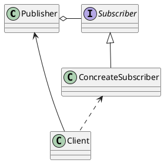
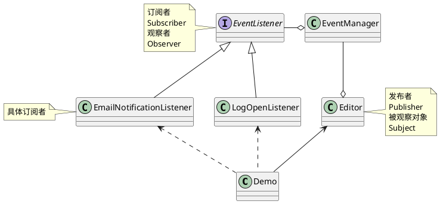
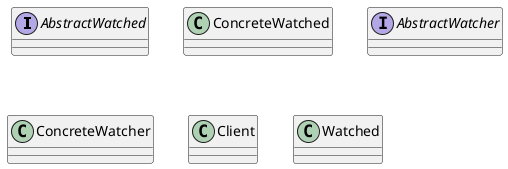

## 观察者模式, Observer pattern
定义对象间的一种一对多的依赖关系，当一个对象的状态发生改变时，所有依赖于它的对象都得到通知并被自动更新。

观察者模式 (Observer）又称发布-订阅模式 (Publish-Subscribe：Pub/Sub）。它是一种通知机制，让发送通知的一方 (被观察方）和接收通知的一方 (观察者）能彼此分离，互不影响。

观察者模式 (有时又被称为发布-订阅模式、模型-视图模式、源-收听者模式或从属者模式) 是软件设计模式的一种。在此种模式中，一个目标物件管理所有相依于它的观察者物件，并且在它本身的状态改变时主动发出通知。这通常透过调用各观察者所提供的方法来实现。此种模式通常被用来实作事件处理系统。

此模式完美的将观察者和被观察的对象分离开。举个例子，用户界面可以作为一个观察者，业务数据是被观察者，用户界面观察业务数据的变化，发现数据变化后，就显示在界面上。面向对象设计的一个原则是: 系统中的每个类将重点放在某一个功能上，而不是其他方面。一个对象只做一件事情。观察者模式在模块之间划定了清晰的界限，提高了应用程序的可维护性和重用性。
  
观察者模式有很多实现方式，从根本上说，该模式必须包含两个角色: 观察者和被观察对象。在刚才的例子中，业务数据是被观察对象，用户界面是观察者。观察者和被观察者之间存在"观察"的逻辑关联，当被观察者发生改变的时候，观察者就会观察到这样的变化，并且做出相应的响应。如果在用户界面、业务数据之间使用这样的观察过程，可以确保界面和数据之间划清界限，假定应用程序的需求发生变化，需要修改界面的表现，只需要重新构建一个用户界面，业务数据不需要发生变化。
  
实现观察者模式的时候要注意，观察者和被观察对象之间的互动关系不能体现成类之间的直接调用，否则就将使观察者和被观察对象之间紧密的耦合起来，从根本上违反面向对象的设计的原则。无论是观察者"观察"观察对象，还是被观察者将自己的改变"通知"观察者，都不应该直接调用。
  
实现观察者模式有很多形式，比较直观的一种是使用一种"注册——通知——撤销注册"的形式。



### 发布者, Publisher, 被观察对象, Subject
发布者  (Publisher） 会向其他对象发送值得关注的事件。 事件会在发布者自身状态改变或执行特定行为后发生。 发布者中包含一个允许新订阅者加入和当前订阅者离开列表的订阅构架。

当新事件发生时， 发送者会遍历订阅列表并调用每个订阅者对象的通知方法。 该方法是在订阅者接口中声明的。

### 订阅者, Subscriber, 观察者, Observer
订阅者  (Subscriber） 接口声明了通知接口。 在绝大多数情况下， 该接口仅包含一个 update更新方法。 该方法可以拥有多个参数， 使发布者能在更新时传递事件的详细信息。

 (Observer) 将自己注册到被观察对象 (Subject) 中，被观察对象将观察者存放在一个容器 (Container) 里。

### 具体订阅者  (Concrete Subscribers）
具体订阅者  (Concrete Subscribers） 可以执行一些操作来回应发布者的通知。 所有具体订阅者类都实现了同样的接口， 因此发布者不需要与具体类相耦合。

订阅者通常需要一些上下文信息来正确地处理更新。 因此， 发布者通常会将一些上下文数据作为通知方法的参数进行传递。 发布者也可将自身作为参数进行传递， 使订阅者直接获取所需的数据。

客户端  (Client） 会分别创建发布者和订阅者对象， 然后为订阅者注册发布者更新。


---

1. 观察者
  
 (Observer) 将自己注册到被观察对象 (Subject) 中，被观察对象将观察者存放在一个容器 (Container) 里。
  
2. 被观察对象
  
被观察对象发生了某种变化 (如图中的SomeChange) ，从容器中得到所有注册过的观察者，将变化通知观察者。
  
3. 撤销观察
  
观察者告诉被观察者要撤销观察，被观察者从容器中将观察者去除。
  
观察者将自己注册到被观察者的容器中时，被观察者不应该过问观察者的具体类型，而是应该使用观察者的接口。这样的优点是: 假定程序中还有别的观察者，那么只要这个观察者也是相同的接口实现即可。一个被观察者可以对应多个观察者，当被观察者发生变化的时候，他可以将消息一一通知给所有的观察者。基于接口，而不是具体的实现——这一点为程序提供了更大的灵活性。
  
观察者模式定义了一种一对多的依赖关系，让多个观察者对象同时监听某一个主题对象。这个主题对象在状态上发生变化时，会通知所有观察者对象，让他们能够自动更新自己

观察者模式的组成

1.抽象主题角色:把所有对观察者对象的引用保存在一个集合中，每个抽象主题角色都可以有任意数量的观察者。抽象主题提供一个接口，可以增加和删除观察者角色。一般用一个抽象类或接口来实现
  
2.抽象观察者角色:为所有具体的观察者定义一个接口，在得到主题的通知时更新自己。
  
3.具体主题角色(Watched):把所有对观察者对象的引用保存在一个集合中，每个抽象主题角色都可以有任意数量的观察者。抽象主题提供一个接口，可以增加和删除观察者角色。一般用一个抽象类或接口来实现。
  
4.具体观察者角色(Watcher):为所有具体的观察者定义一个接口，在得到主题的通知时更新自己

A.自定义观察者模式


### 抽象主题角色类

```java
public interface AbstractWatched {
    //增加一个观察者
    public void addAbstractWatcher(AbstractWatcher watcher);

    //移除一个观察者
    public void removeAbstractWatcher(AbstractWatcher watcher);

    //移除所有的观察着
    public void removeAll();

    //通知所有的观察者
    public void notifyWatchers();
} 
```

2.抽象观察者角色

```java
public interface AbstractWatcher {
    public void update();
}  
```

3.具体主题角色(Watched)

```java
import java.util.ArrayList;
import java.util.List;

public class ConcreteWatched implements AbstractWatched {
    // list: 存放观察者的一个集合对象
    List<AbstractWatcher> list = new ArrayList<>();

    // 增加一个观察者
    public void addAbstractWatcher(AbstractWatcher watcher) {
        list.add(watcher);
    }

    // 移除一个观察者
    public void removeAbstractWatcher(AbstractWatcher watcher) {
        list.remove(watcher);
    }

    // 移除所有的观察着
    public void removeAll() {
        list.clear();
    }

    // 通知所有的观察者
    public void notifyWatchers() {
        for (AbstractWatcher watcher : list) {
            watcher.update();
        }
    }
}

```

4.具体观察者角色(Watcher)

```java
public class ConcreteWatcher implements AbstractWatcher {
    //观察到被观察者发生变化时，执行的方法
    public void update() {
        System.out.println("update.....");
    }
}
```

5.客户端调用: 

```java
public class ClientTest {
    public static void main(String[] args) {
        //定义一个被观察者对象
        AbstractWatched watched = new ConcreteWatched();

        //定义三个观察者对象
        AbstractWatcher watcher1 = new ConcreteWatcher();
        AbstractWatcher watcher2 = new ConcreteWatcher();
        AbstractWatcher watcher3 = new ConcreteWatcher();

        //被观察者添加观察者. 被观察者和观察者之间关系是一对多关系
        watched.addAbstractWatcher(watcher1);
        watched.addAbstractWatcher(watcher2);
        watched.addAbstractWatcher(watcher3);

        System.out.println("第1次...");
        //被观察者发生改变时，通知观察者执行相应方法
        watched.notifyWatchers();

        //移除一个观察者
        watched.removeAbstractWatcher(watcher2);

        System.out.println("第2次...");
        //被观察者发生改变时，通知观察者执行相应方法
        watched.notifyWatchers();

        //移除一个所有观察者
        watched.removeAll();
        System.out.println("第3次...");
        //被观察者发生改变时，通知观察者执行相应方法
        watched.notifyWatchers();
    }
}
```

执行结果为: 
  
第1次...
  
update.....
  
update.....
  
update.....
  
第2次...
  
update.....
  
update.....
  
第3次...

B:对于java的观察者模式框架

从AWT1.1开始图形系统的事件模型采用观察者模式，因此观察者模式在Java语言中的地位极其重要
  
在xml解析中的SAX也采用了观察者模式来实现
  
### Java也提供了对观察者模式的内置支持, Observer和Observable在Java 9标记为废弃。
内置观察者模式主要有2个类，一个是类Observable,一个是接口类Observer

Observable类是被观察者，子类只要继承它即可。而且添加观察者等方法已经都实现了.
  
Observer是观察者，只有一个接口方法public void update(Observable arg0, Object arg1)，需要其子类来实现.这里，observOb是被观测的对象，而arg是由notifyObservers( )方法传递的值。当被观测对象发生了改变，调用update( )方法

1. 被观察者要继承Observable类

2. 被观察者通知观察者时，也就是调用notifyObservers方法时，一定要先调用setChanged()方法(该方法的作用就是将对象里面的changed这个boolean变量设定为true，因为notifyObservers要首先检查该变量是否为true，如果为false就不执行而直接返回了)

3. Observable类的两个重载的notifyObservers方法，带参数的那个方法，里面的参数就是Observer接口中的update方法中的第二个参数

一个被观测的对象必须服从下面的两个简单规则。第一，如果它被改变了，它必须调用setChanged( )方法。第二，当它准备通知观测程序它的改变时，它必须调用notifyObservers( )方法。这导致了在观测对象中对update( )方法的调用。注意——当对象在调用notifyObservers( )方法之前，没有调用setChanged( )方法，就不会有什么动作发生。在update( )被调用之前，被观测对象必须调用setChanged( )和notifyObservers( )两种方法

例如: 
  
被观察者: 

```java
import java.util.Observable;

public class Watched extends Observable {
    public void count(int number) {
        for (; number >= 0; number--) {
            setChanged();
            // 注意notifyObservers()有两种形式: 一种带有参数而另一种没有。当用参数调用notifyObservers( )方法时，
            // 该对象被传给观测程序的update( )方法作为其第二个参数。
            // 否则，将给update( )方法传递一个null。可以使用第二个参数传递适合于你的应用程序的任何类型的对象。
            // 也就是说notifyObservers()内部实际调用的是notifyObservers(null);
            notifyObservers(number);
        }
    }
} 
```

第一个观察者

```java
import java.util.Observable;
import java.util.Observer;

public class Watcher implements Observer {
    public void update(Observable arg0, Object arg1) {
        System.out.println((Integer) arg1);
    }
}
```

第二个观察者: 

```java
import java.util.Observable;
import java.util.Observer;

public class Watcher2 implements Observer {
    public void update(Observable arg0, Object arg1) {
        if ((Integer) arg1 == 0) {
            System.out.println("done");
        }
    }
}
```

### 客户端调用
```java
public class Client {
    public static void main(String[] args) {
        //定义一个被观察者
        Watched watched = new Watched();
        //定义2个观察者
        Watcher watcher = new Watcher();
        Watcher2 watcher2 = new Watcher2();
        //给被观察者添加观察者
        watched.addObserver(watcher);
        watched.addObserver(watcher2);
        watched.count(10);
    }
}
```

输出结果为: 
  
done

### Observer类和Observable类在Java 9标记为废弃。
废弃原因
Observer和Observable有几个原因：

1. 不能序列化

Observable没有实现Serializable接口，它的内部成员变量都是私有的，子类不能通过继承它来对Observable的成员变量处理。所以子类也不能序列化。

参考：Why is java.util.Observable class not serializable.

2. 不是线程安全

在 java.util.Observable文档里没有强制要求Observable是线程安全的，它允许子类覆盖重写Observable的方法，事件通知无序以及事件通知发生在不同的线程里，这些都是会影响线程安全的问题。

参考：Documentation of java.util.Observable

3. 支持事件模型的功能简单

支持事件模型的功能很简单，例如，只是支持事情发生变化的概念，但是不能提供更多哪些内容发生了改变。

参考：deprecate Observer and Observable

解决方案

可以使用java.beans 里的 PropertyChangeEvent 和 PropertyChangeListener 来代替目前Observer和Observable的功能。

示例
```java
public class Demo {  
  
  private String name;  
  private PropertyChangeSupport listeners = new PropertyChangeSupport(this);  
    
  public Demo() {  
      this.name= "my name";  
  }  

  public String getName() {  
      return this.name;  
  }  
      
  public void setName(String name) {  
      String oldValue = this.name;  
      this.name= name;  
      //发布监听事件  
      firePropertyChange("name", oldValue, demoName);  
  }  
      
  public void addPropertyChangeListener(PropertyChangeListener listener) {  
      listeners.addPropertyChangeListener(listener);  
  }  
      
  public void removePropertyChangeListener(PropertyChangeListener listener){  
      listeners.removePropertyChangeListener(listener);  
  }  
      
  protected void firePropertyChange(String prop, Object oldValue, Object newValue) {  
      listeners.firePropertyChange(prop, oldValue, newValue);  
  }  
}

public class Main {  
  public static void main(String[] args) {  
    Demo demo= new Demo();  
     demo.addPropertyChangeListener(new PropertyChangeListener(){  
      public void propertyChange(PropertyChangeEvent evt) {  
         System.out.println("OldValue:"+evt.getOldValue());  
        System.out.println("NewValue:"+evt.getNewValue());  
        System.out.println("tPropertyName:"+evt.getPropertyName());  
    }});  
     demo.setName("new Name");  
  }  
}
```

http://ttitfly.iteye.com/blog/152512
>https://majing.io/posts/10000001281162
>https://refactoringguru.cn/design-patterns/observer
>https://refactoringguru.cn/design-patterns/observer/java/example