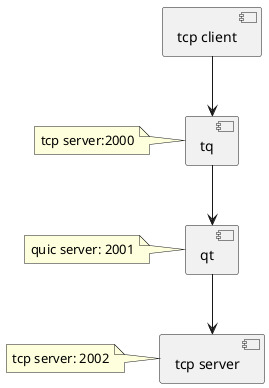

## tcp, quic

### t2q2t
>https://github.com/flano-yuki/t2q2t.git
### tcpcopoy
>https://github.com/session-replay-tools/tcpcopy
### goreplay
>https://github.com/buger/goreplay
### tcpcopy架构漫谈
>https://blog.csdn.net/wangbin579/article/details/8949315
>https://segmentfault.com/a/1190000039285429
>https://github.com/buger/goreplay

